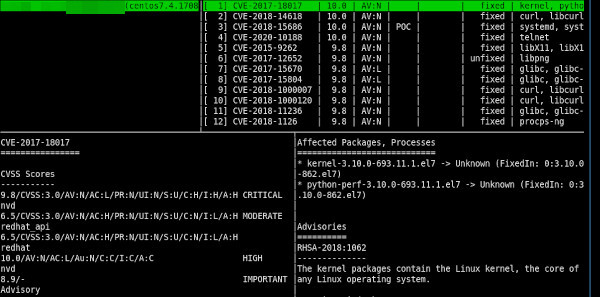
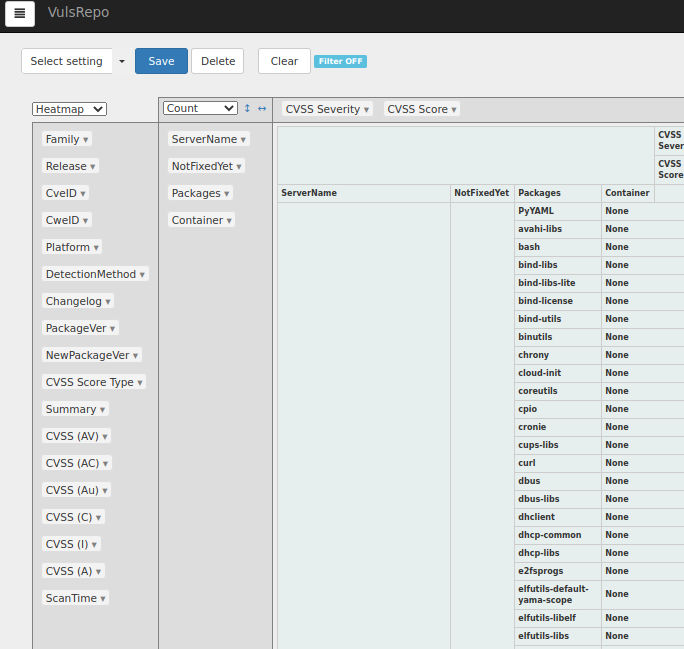
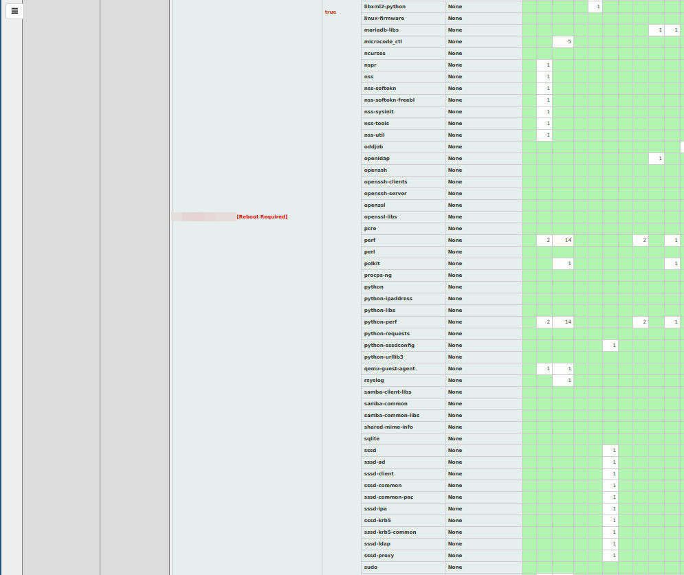

# Vuls agentless vulnerability scanner

[Vuls](https://vuls.io/en/) is open-source, agent-less vulnerability
scanner based on information from NVD, OVAL, etc.

This effort has two playbooks, one to setup Vuls infrastructure
(ie. Vuls docker containers with latest databases with CVEs and
exploits, Vuls server as service and Vulsrepo as service), other one
to get data from managed nodes (ie. installed RPMs, kernel version, OS
type and OS release version) and submits them to Vuls server for
investigation.

## HOWTO

As we use Vuls server as service, we don't need Vuls to SSH to all
managed nodes which are interesting us for scan, but we use power of
Ansible to get data from managed nodes and submit them to Vuls server.

### Setup Vuls infrastructure

```
$ ansible-playbook -i env/prod playbooks/vuls.yml \
  -e target=localhost -c local -vv
```

This would cause to build Vuls infrastructure on control node.

### Scan

The scan is using Ansible, ie. it SSH to every managed node, get list
of packages installed and sends the data to Vuls server via HTTP.

The any scanned CVEs are reported a task will fails BUT it is IGNORED,
human should see Ansible play results, see if 'ignored' has bigger
value than zero.

For local processing the scan also saves on control node the JSON
report file. It can upload some metrics (scannedCves, scannedAt,
reportedAt) for each scanned target to a server to be processed by
Node exporter.

Example of metrics:

```
# cat /var/lib/node_exporter/textfile_collector/vuls-foo.example.com.prom 
vuls_scan_scannedcves{target="foo.examplecom"} 586
vuls_scan_scannedat{target="foo.examplecom"} 1598256000
vuls_scan_reportedat{target="foo.examplecom"} 1598259341
```
The scan itself:

```
ansible-playbook -i env/prod playbooks/vuls_scan.yml \
  -e target=<a managed mode> \
  -e vuls_server_url=http://127.0.0.1:5515/vuls
...
Debug print of number of discovered Cves...
  foo.example.com failed: {
    "changed": false,
    "failed_when_result": true,
    "msg": "inventory_hostname: foo.example.com, scannedAt: 2020-08-27T07:00:00Z, scannedCves: 583"
}
```

'vuls_server_url' defaults to localhost but let's be explicit here for
documentation purposes.

After running the play one would fine new Vuls report JSON files at
both control node and Vuls server:

* control node

```
$ jq '.scannedCves[] | {cveID, affectedPackages}' \
  $(ls -tr /tmp/$(date "+%Y-%m-%dT")*foo.example.com.json | xargs -n1) | head
{
  "cveID": "CVE-2014-3591",
  "affectedPackages": [
    {
      "fixState": "Fix deferred",
      "name": "gnupg2",
      "notFixedYet": true
    },
    {
      "fixState": "Fix deferred",
```

* Vuls server

```
$ sudo ls -l /vuls/results/current/
total 4564
-rw------- 1 root root 4672332 Jul 30 16:26 foo.example.com.json
```

```
$ sudo jq '.scannedCves[] | {cveID, affectedPackaged}' \
  /vuls/results/current/foo.example.com.json | head -n 20
{
  "cveID": "CVE-2014-3591",
  "affectedPackages": [
    {
      "fixState": "Fix deferred",
      "name": "gnupg2",
      "notFixedYet": true
    },
    {
      "fixState": "Fix deferred",
```

JSON report file is not very human readable, thus it would be much
better to start `vuls tui` on Vuls server (one can reuse already
running Vuls server container)

```
# vuls_container=$(docker ps | awk '$2 == "vuls/vuls" { print $1 }')
# docker exec -it ${vuls_container} vuls tui
```



or Vuls repo web UI to inspect the report.

## Vuls repo

This is a web UI for Vuls. It seems that best way how to interpret
Vuls reports is to setup Vulsrepo as on the following screenshots.




By default Vulsrepo listens on 5515/tcp port.
